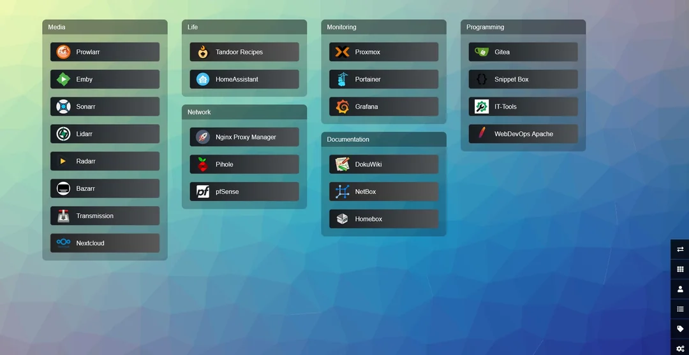

## Homer
```
nano /var/www/html/dashboard/assets/custom.css


```


## Flame
https://github.com/pawelmalak/flame


## Flare
https://soulteary.com/2022/02/23/building-a-personal-bookmark-navigation-app-from-scratch-flare.html

## jump
https://github.com/daledavies/jump


## Glance


## Heimdall


```
`body {  
background: #eee;  
}  
.app-icon {  
border-radius:6px;  
max-height: 50px !important;  
}  
#app main, #app #sortable{  
margin: auto;  
width: 1200px;  
}  
div.item {  
background-color:rgba(255,255,255,0.01) !important;  
border:0px solid rgba(215,215,215,0.5);  
width:130px !important;  
height: 130px !important;  
transform:scale(0.9);  
margin:20px 0 !important;  
text-align: center;  
display: block;  
padding-right: 15px !important;  
background-image: none;  
}  
div.app-icon-container {  
opacity:0.9;  
margin: 0 auto;  
background: white;  
border-radius: 6px;  
box-shadow: 0 1px 5px rgba(0,0,0,.3);  
padding: 15px;  
align-items: center;  
width: 80px;  
height: 80px;  
}  
.item::after {  
display:none;  
box-shadow:0 0 40px 0px rgba(0,0,0,0.1) !important;  
}  
svg.svg-inline--fa.fa-arrow-alt-to-right {  
color:rgba(30,30,30,0.5) !important;  
}  
.homesearch {  
height:40px;  
}  
.searchform button {  
height:40px;  
line-height:0px !important;  
}  
.searchform input {  
outline-style: none;  
}  
.searchform{  
margin: 50px auto 0px auto !important;  
}  
div#app{  
background-repeat: repeat;  
background-size: auto !important;  
}  
#config-buttons a{  
background: rgba(0, 0, 0, 0.12);  
}  
div#sortable.ui-sortable {  
padding-top:0px !important;  
}

.item .title {  
color: #000 !important;  
margin-top: 10px;  
text-shadow: 1px 1px 1px rgba(200,200,200,.5);  
}

svg.svg-inline--fa.fa-arrow-alt-to-right{  
display: none;  
}

.item .link {  
padding-right: 0px;  
}`
```



```
/*masonry grid layout*/
#app #sortable.categories{
     display:inline-block;
     column-count:4;
     display:block;
}

/*center all columns in screen.*/
#app #sortable.categories{
     width:min-content;
}

/*set column count depending on screen width*/
@media only screen and (max-device-width: 767px) {
     #app #sortable.categories{
          column-count:1;
     }
     #config-buttons a{
          width:35px;
          height:35px;
    }
}

@media only screen and (min-device-width: 768px) and (max-device-width: 1160px) {
     #app #sortable.categories{
          column-count:2;
     }
}

@media only screen and (min-device-width: 1161px) and (max-device-width: 1515px){
     #app #sortable.categories{
          column-count:3;
     }
}

/*remove flex of category boxes*/
.category{
     display:inline-block;
}

/*change color and spacing of header box*/
#app #sortable.categories .category > .title{
     padding:10px 0px 10px 15px;
     border-radius: 10px 10px 0px 0px;
     background-color:#0000004f;
}

/*make buttons smaller*/
.item{
    height:50px
}

/*make all buttons same background color/*
/*requires removing individual overrides*/
.item{
    background-color:#161b1f;
}

/*hide white bubble*/
.item::after{
    display:none
}

/*hide arrow*/
.fa-arrow-alt-to-right{
     display:none;
}

/*change icon size*/
.app-icon{
     max-width:36px;
     max-height:36px;
}

/*change left padding of icon*/
.app-icon-container{
     flex-basis:36px;
}

/*realised I never actually read these*/
.tooltip{
     display:none;
}

/*make css editing area wider*/
/*you'll want to make this responsive if you do this on a phone*/
.module-container{
     max-width:1090px;
}
div.create .input{
     width:1020px;
}
div.create .input textarea{
     width:1020px;
     height:600px;
}


/*category entrance effect*/
.category{
	-webkit-animation: slide-in-top 0.5s cubic-bezier(0.250, 0.460, 0.450, 0.940) both;
	        animation: slide-in-top 0.5s cubic-bezier(0.250, 0.460, 0.450, 0.940) both;

}

/*animasta keyframes for effect*/

@-webkit-keyframes slide-in-top {
  0% {
    -webkit-transform: translateY(-1000px);
            transform: translateY(-1000px);
    opacity: 0;
  }
  100% {
    -webkit-transform: translateY(0);
            transform: translateY(0);
    opacity: 1;
  }
}
@keyframes slide-in-top {
  0% {
    -webkit-transform: translateY(-1000px);
            transform: translateY(-1000px);
    opacity: 0;
  }
  100% {
    -webkit-transform: translateY(0);
            transform: translateY(0);
    opacity: 1;
  }
}
```


## Homepage
http://IP:3000
```bookmarks.yaml
- Developer:
    - Github:
        - icon: gitlab.svg
          href: https://github.com/

- Social:
    - Reddit:
        - abbr: RE
          href: https://reddit.com/

- Entertainment:
    - YouTube:
        - abbr: YT
          href: https://youtube.com/
```

