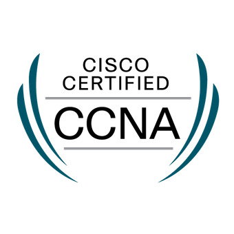
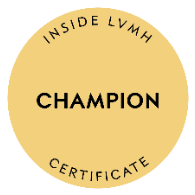
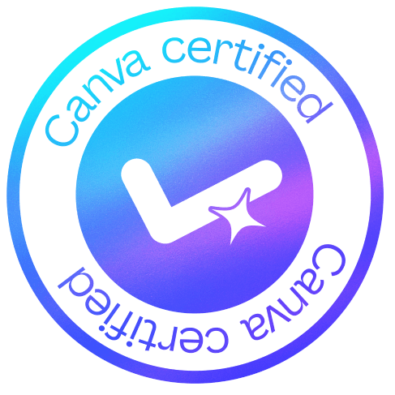

繞了一大圈的工程師

技能

## 證照

  

    
      

  CCNA

  

  

    
      

    AZ-900

  

  

    
      

    OCI Architect

  

  

    
      

    OCI AI  Foundations

  

  

    
      

    Google Analytics

  

  

    
      

    電腦硬體裝修丙級

  

## 其他證照

  

    
      

 Google AI in  K12 Educators

  

  

    
      

 Google Generative  AI for Educators

  

  

    
      

 Google Gemini  Educator 

  

  

    
      

  Google Educator  Level 1

  

  

    
      

  Google Educator  Level 2

  

  

    
      

  LVMH

  

  
  

    
      

  Canva

  

  

    
      

  WD-40 cert.

  

  

## 聯絡我

- [Credly 連結](https://www.credly.com/users/jun-ping-ni/badges)
- Linkedin
