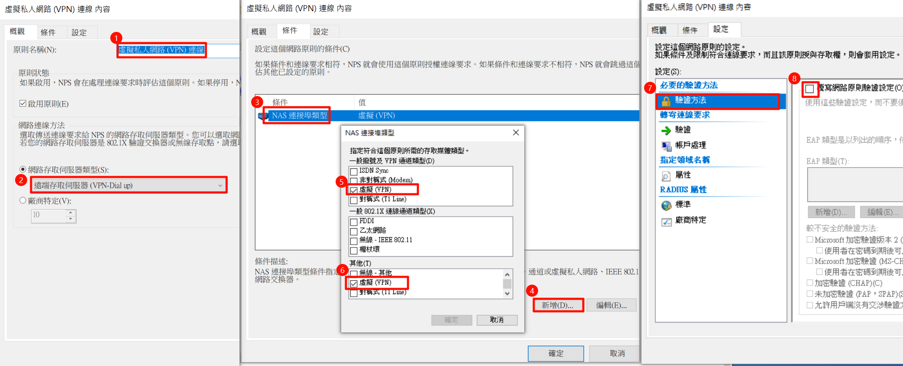
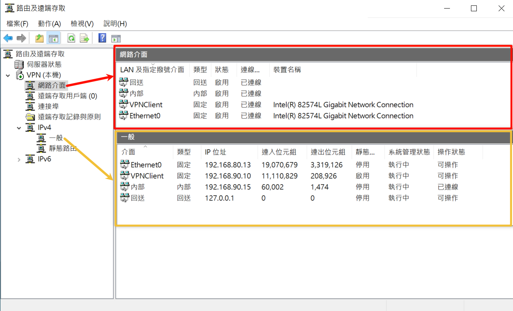
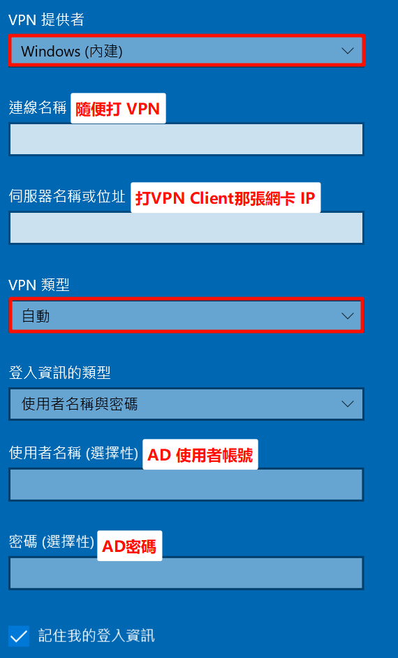

---
title: "Radius 企業驗證伺服器架設 "
date: 2026-01-05
draft: false
toc: true

---

VM 環境
- AD+CA：192.168.80.10  VMNet8 NAT 192.168.80.0/24
- RADIUS：192.168.80.11 VMNet8 NAT 192.168.80.0/24
- VPN：192.168.80.13 VMNet9 Host-Only 192.168.90.0/24
Host IP 乙太網路：192.168.8.6
測試端口轉發

`VM：ncat -u -l 2300`  -u 為發出udp，無指定為tcp
`Host: ncat 192.168.8.50 2300`


※有時候VMware Workstation 端口轉發會失敗，重新啟動服務
## 設定802.1X Wireless AP及VPN


(1) 連線要求原則及網路原則都有順序，要把安全無線跟VPN處理順序放置在最上方
(2) NPS(主機)/標準設定/802.1X或VPN進入精靈畫面設定，使用精靈畫面設定結束有時會出現2個用戶端，刪掉一個重複就好
(3) 連線要求原則

### VPN
條件:NAS連接，802.1X為無線-IEEE 802.11,無線-其他
設定:驗證方法為空不能打勾



### 802.1X

條件:NAS連接，802.1X為無線-IEEE 802.11,無線-其他
設定:驗證方法為空不能打勾

(4) 網路原則
## 設定VPN Server



VPN Server 串接Radius Sever 容易有bug，記得在VPN Server `改 RADIUS Secret 後要切回 Windows Auth 再改回 RADIUS` (原因在於RRAS 使用 RADIUS 會快取 Shared Secret，舊的 Secret 不會被清掉)

```
net stop ias & net start ias
net stop remoteaccess & net start remoteaccess
```


## 設定連線

1.802.1X Wireless AP


2.VPN連線
